I went to Morocco and somehow thought it would be a good idea to shoot that entire trip on some really bad quality disposables I bought while I was there. I had a few left when I came back, so here are some from various trips I used them for after that.

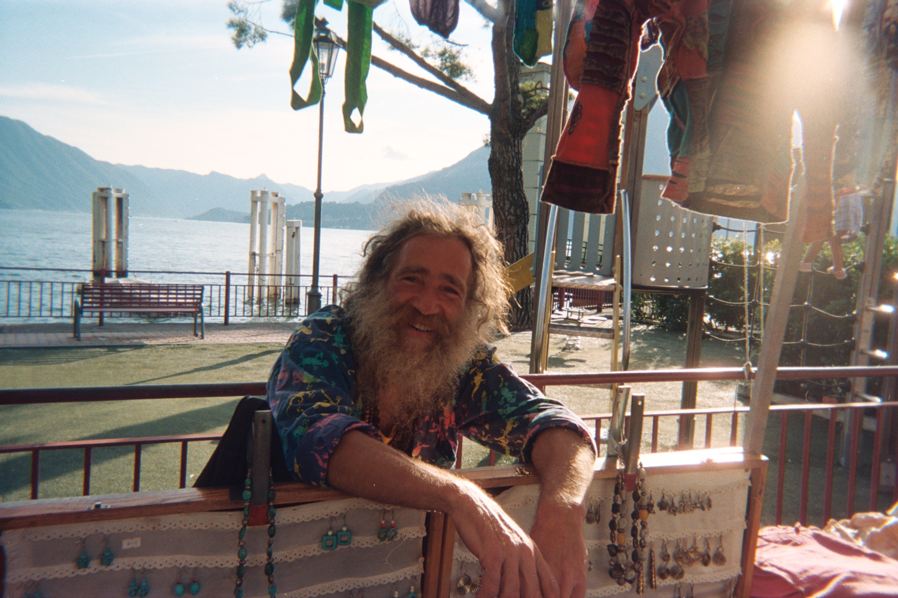
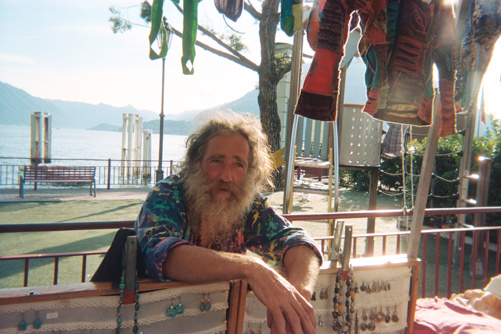
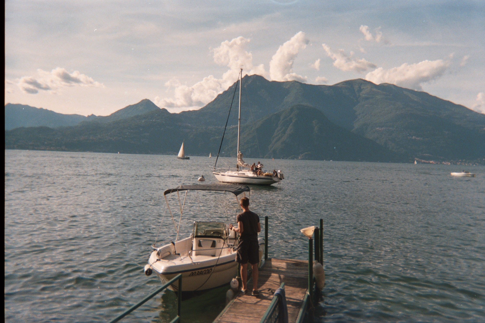

    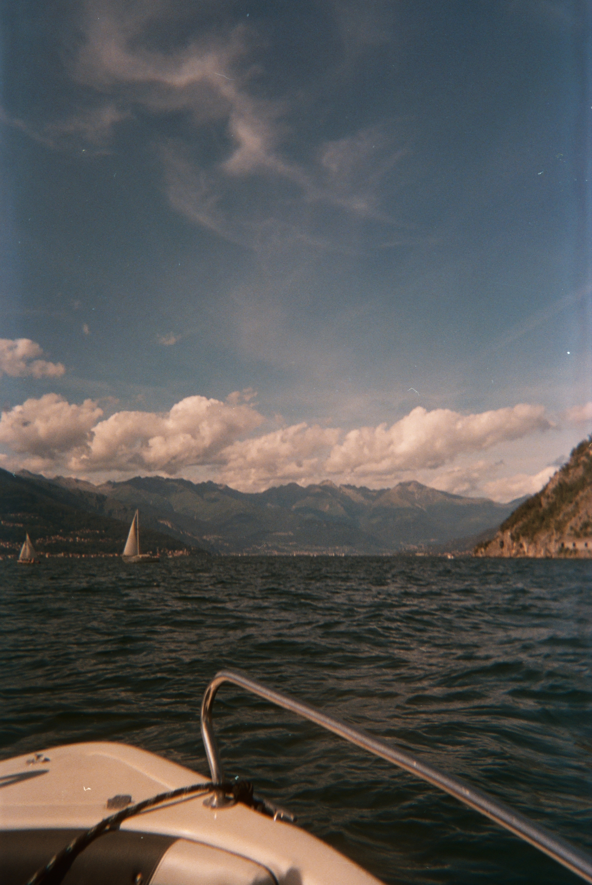
    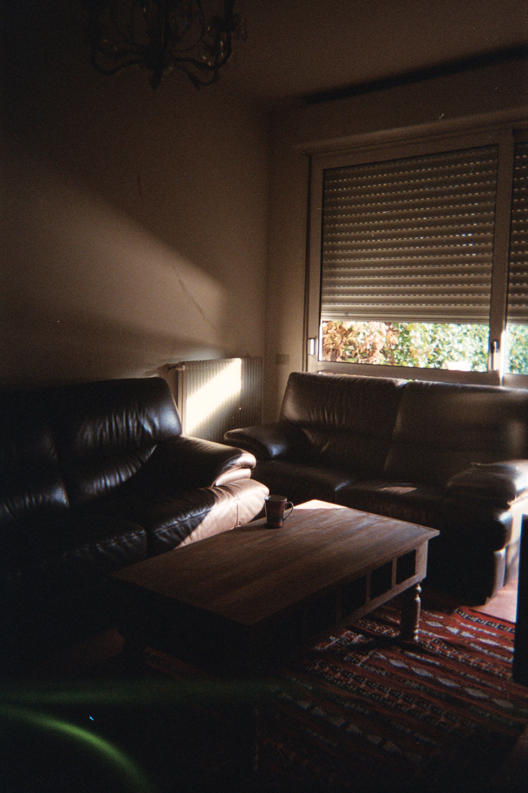

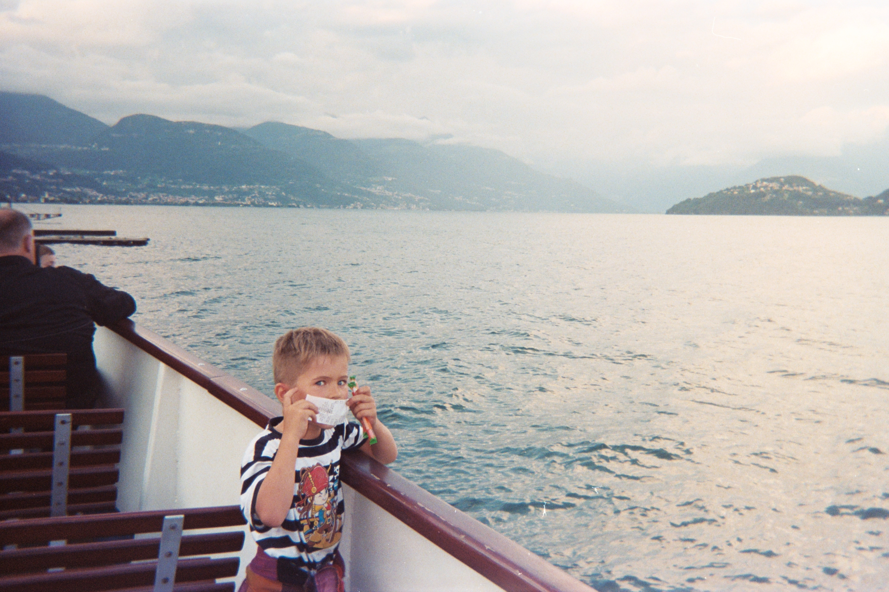
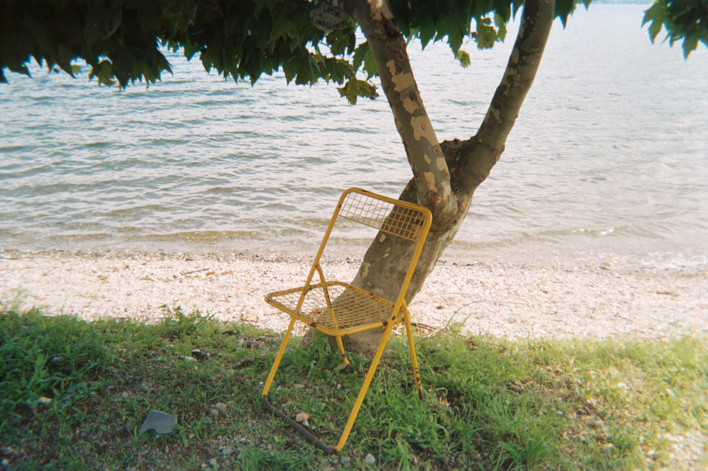
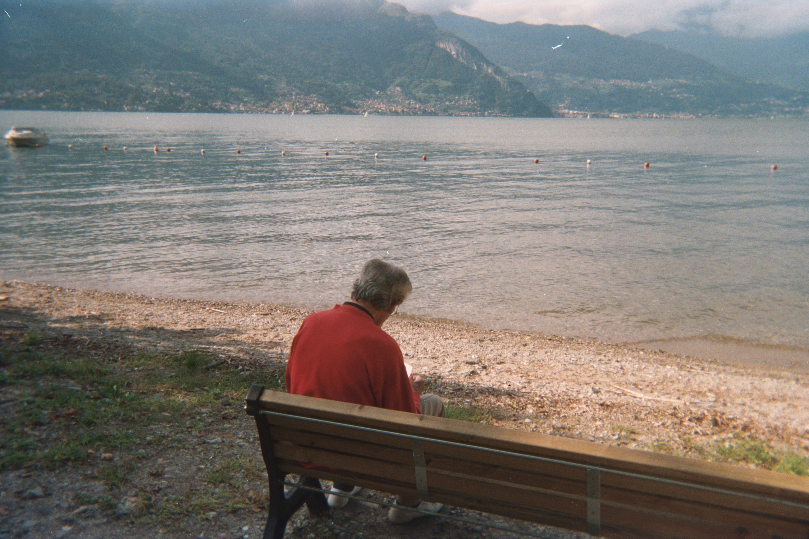
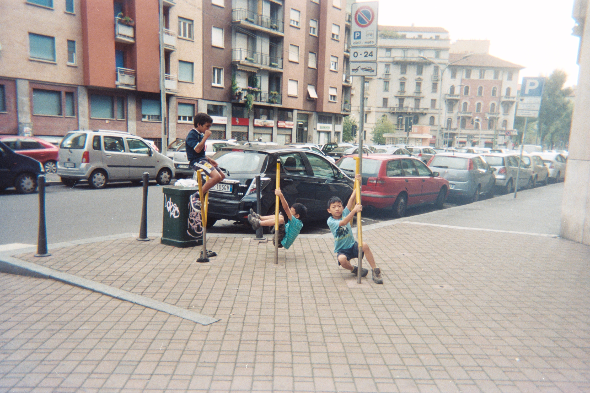

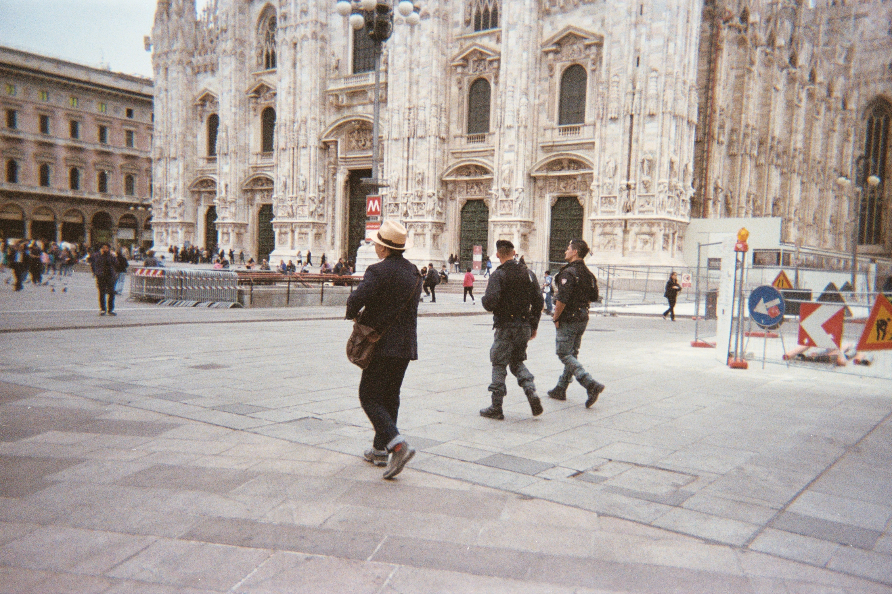

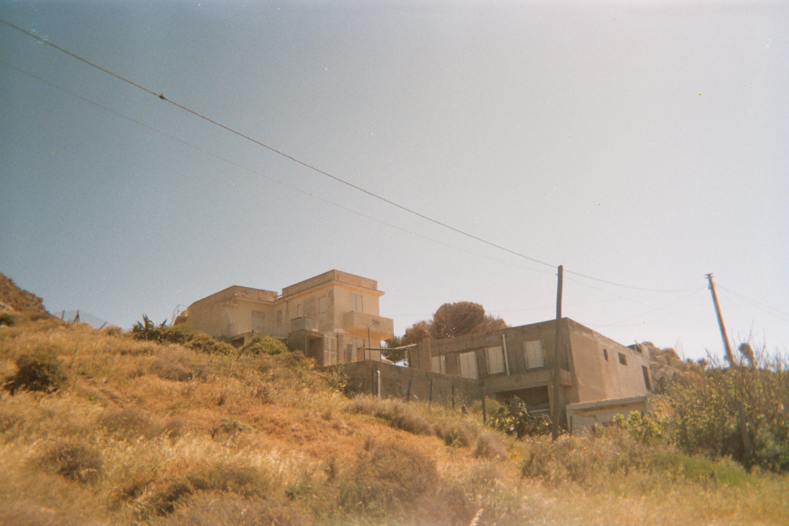
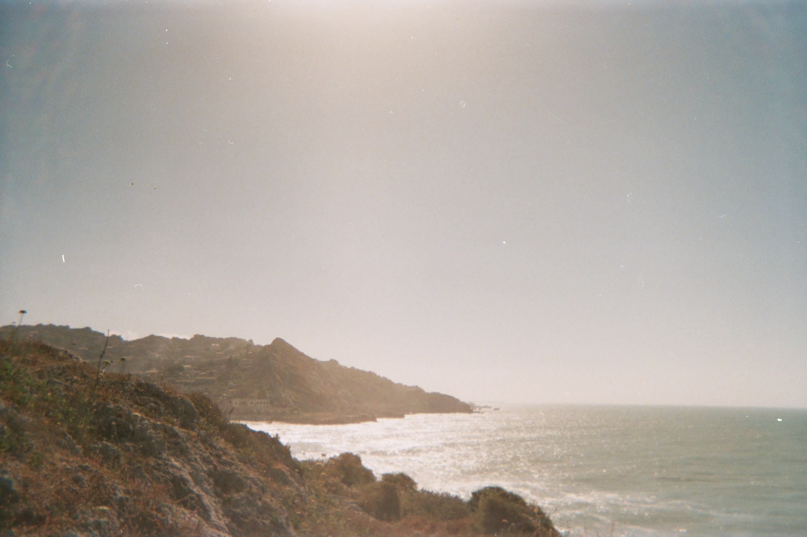
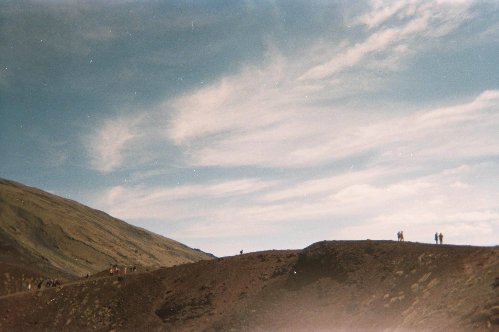

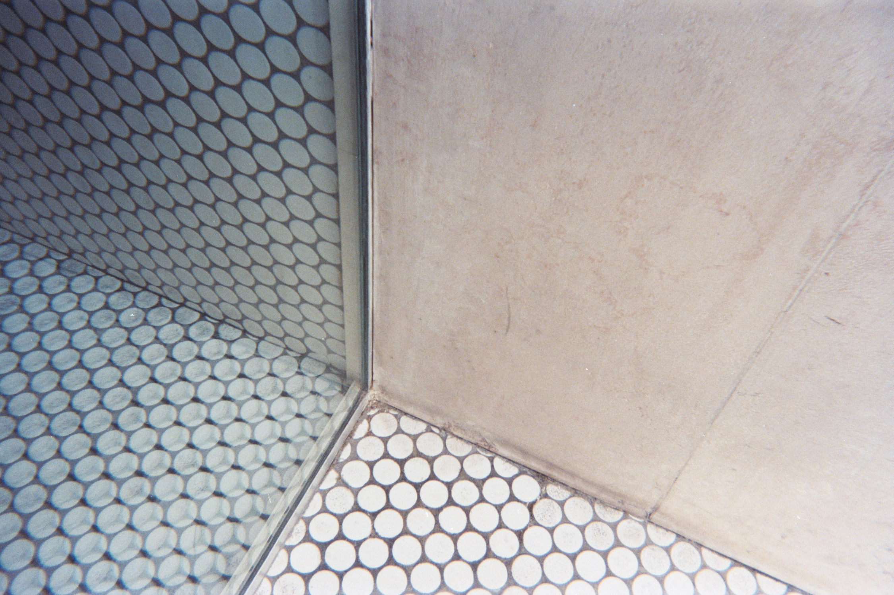
