A few shots taken in Glasgow on my Canon AE-1 with a 50mm 1.8.
The Canon AE-1 was my first ever film camera, which I got almost a decade ago, so we go back a long time.

I think the film stock was some pound store Agfa Vista 200.

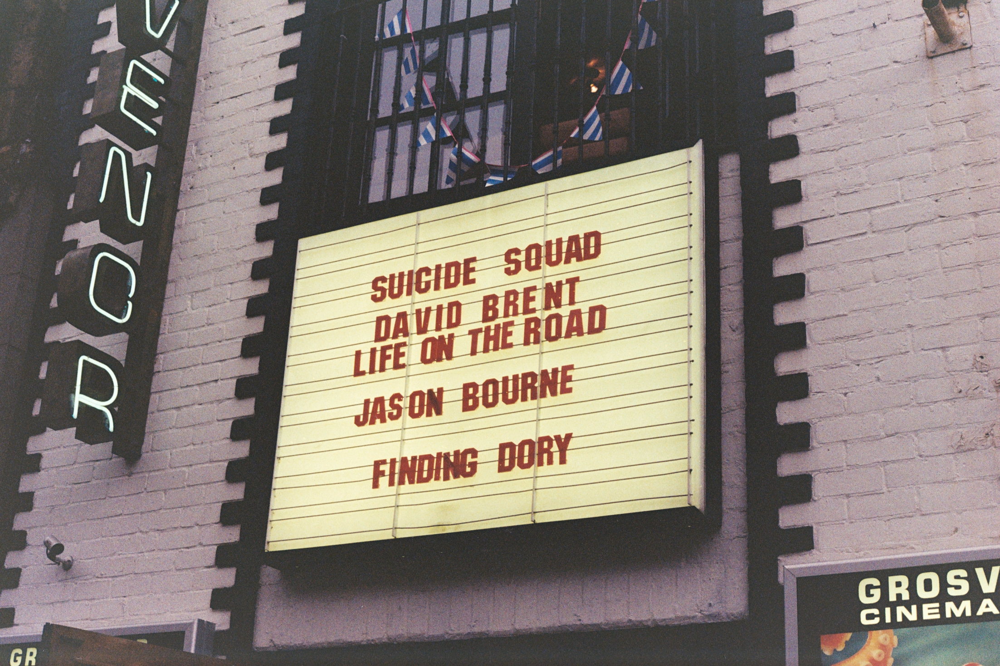
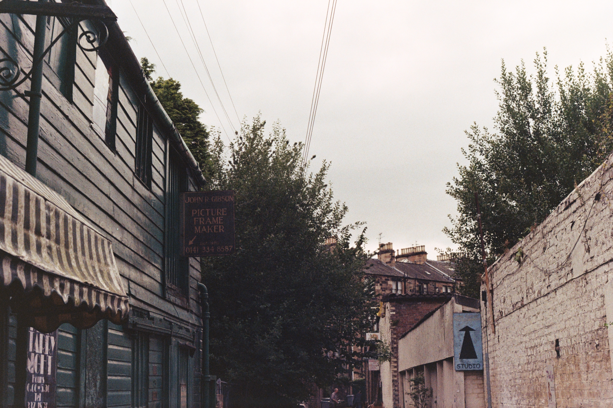
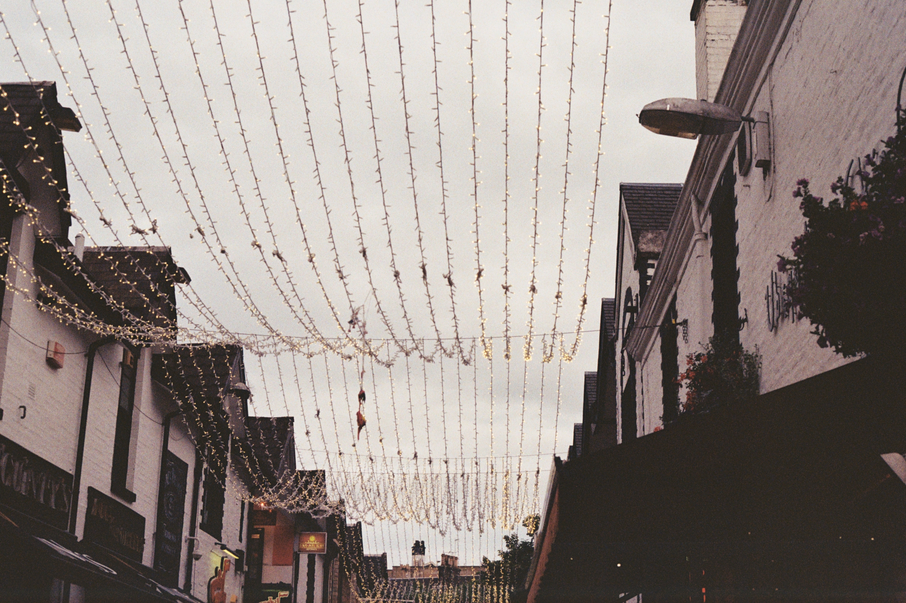
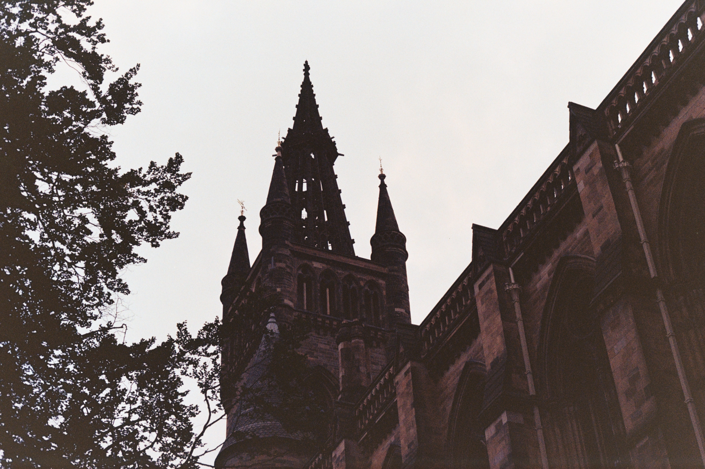
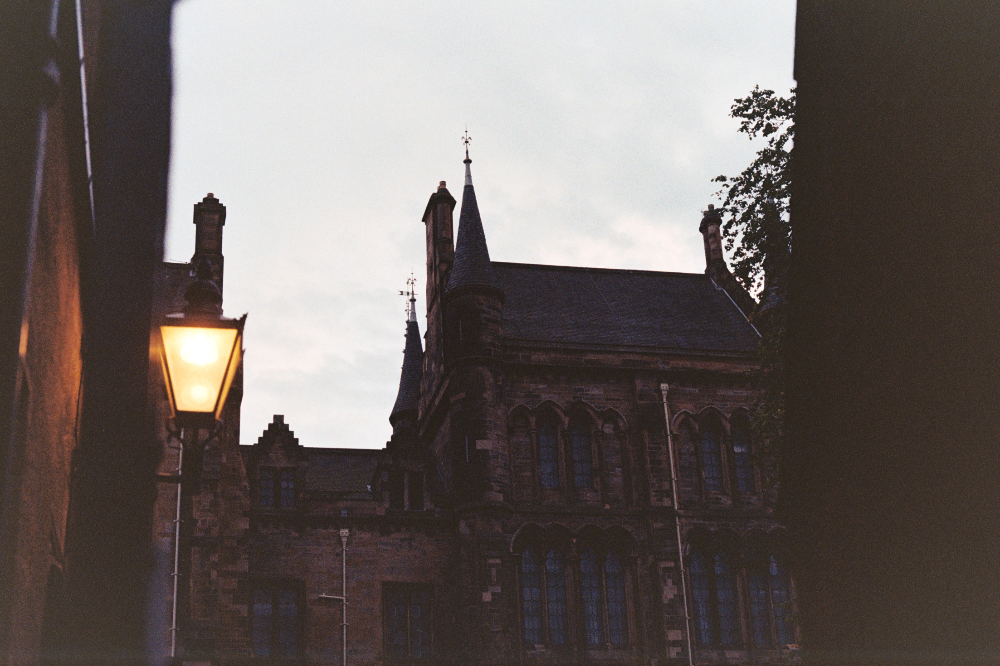

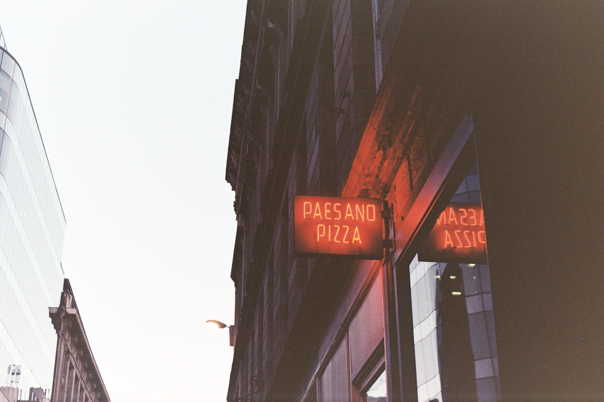
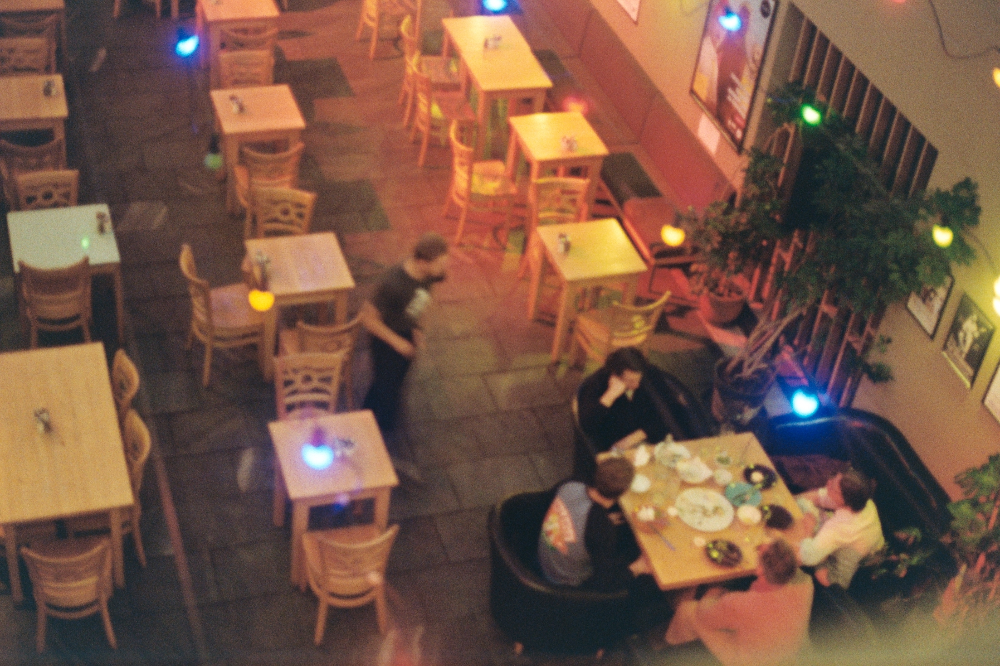
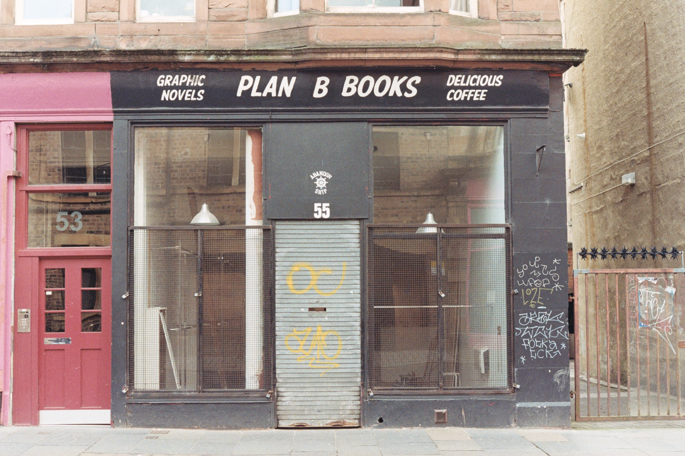
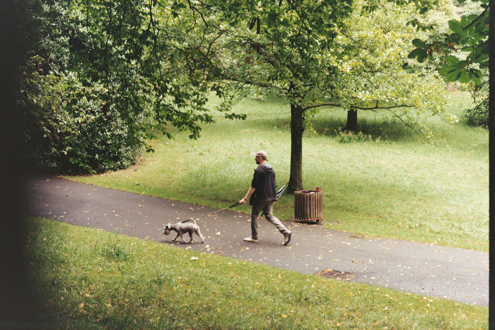

    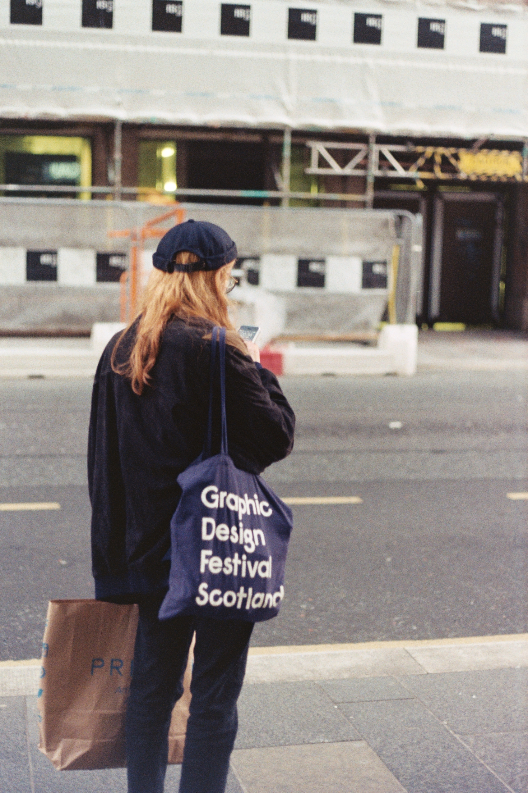
    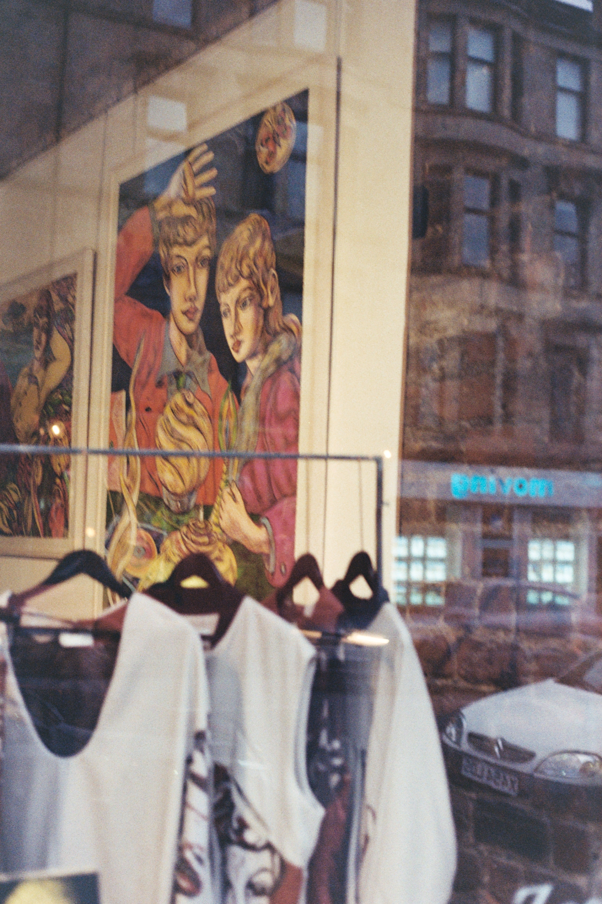

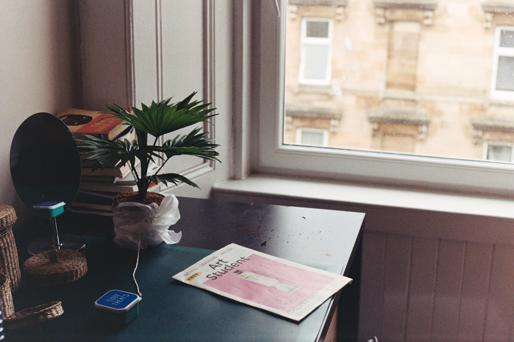
